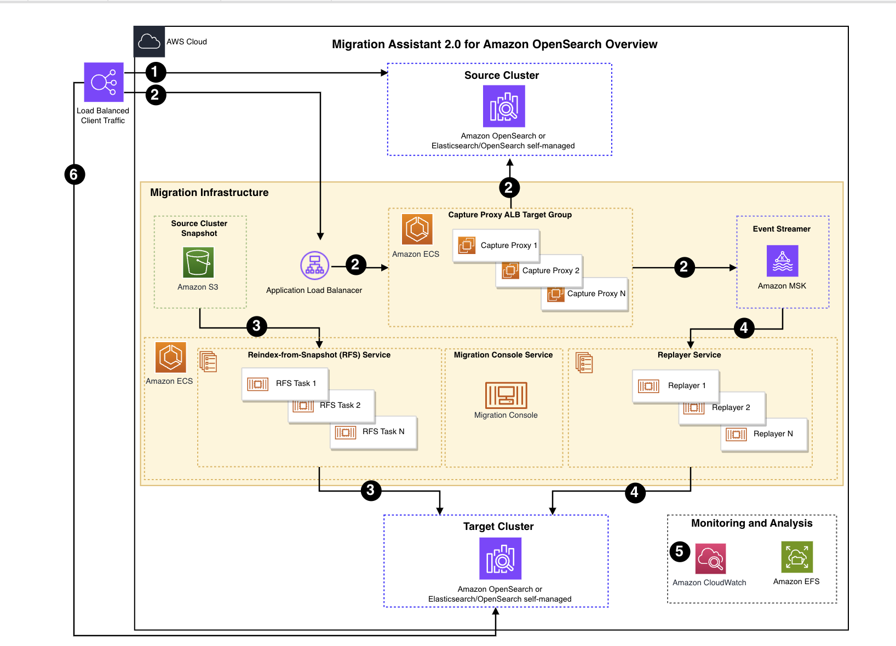

# Migration Assistant for Amazon OpenSearch

The Migration Assistant for Amazon OpenSearch Service solution is a toolkit designed to ease the transition to OpenSearch, facilitate upgrades to the latest OpenSearch versions, and refine cluster configurations based on observed traffic patterns. Whether you're looking to set up a proof-of-concept in AWS, transition production workloads with confidence, or enhance your current OpenSearch clusters, this guide provides references to step-by-step instructions, best practices, and insights to leverage the full potential of the OpenSearch migrations package.

## Table of content

- [Migration Assistant for Amazon OpenSearch](#migration-assistant-for-amazon-opensearch)
  - [Table of content](#table-of-content)
  - [Use Cases](#use-cases)
  - [Solution Overview](#solution-overview)
  - [Architecture](#architecture)
  - [Deployment](#deployment)
  - [OpenSearch Migrations Repo](#opensearch-migrations-repo)
  - [Collection of Operational Metrics](#collection-of-operational-metrics)
  - [License](#license)

## Solution Overview

The solution has the following features:

### Historical backfill with capture and restore
This solution guides users through the process of transferring data from an originating (source) cluster to a designated (target) cluster.

### Live traffic capture and replay
The solution offers guidance and tools to intercept traffic intended for an original cluster and archive it for future replay on a destination cluster. Typically, the replay occurs at the same rate and concurrency as the original traffic to precisely mimic the workload experienced by the source cluster. Users can choose to replay the recorded traffic subsequently or adjust the replay speed. This flexibility enables users to fine-tune the target cluster, enhancing its performance to suit their requirements.

### Traffic verification
The solution records requests and responses between the source and destination clusters for comparison. It then forwards the latency metrics and response codes to an analytics platform, enabling users to analyze the data essential for transitioning their traffic from a legacy system to a new Amazon OpenSearch destination.

## Use Cases
### Migrating historical data
Migration Assistant for Amazon OpenSearch Service offers various options for migrating historical data, including detailed guidance on running a historical migration applicable across all supported migration routes, such as from Elasticsearch 7.10.2 to OpenSearch 1.0.

### Near real-time migration of HTTP traffic between clusters
The solution offers you the option to capture data destined for a source cluster and store this data for reuse. A user can replay this data to a target cluster in near real-time to migrate as soon as possible, or replay at a later time. 

### Replay traffic to multiple targets
The solution allows you to capture traffic for replay through multiple instances or in sequential runs, facilitating the validation of diverse cluster workloads and configurations.

### Precise simulation of your cluster workloads
The solution allows users to capture and replay traffic either simultaneously with multiple instances, or in separate sequential runs. This feature aids in validating different cluster workloads and configurations. By default, the Replayer preserves the original concurrency and request rate to accurately simulate production loads, ensuring a fair like-for-like comparison.

### Verify target cluster results
The solution facilitates user comparisons of source and target traffic in terms of accuracy and performance. It captures metrics and logs for analysis, providing users with the necessary confidence to migrate their production traffic to a new target.

## Architecture

Deploying this solution with the default parameters builds the following environment in the AWS Cloud.

The high-level process flow for the solution components deployed with the AWS CloudFormation template is as follows:

1. Client traffic is directed to the existing cluster.
2. An ALB with Capture Proxies relaying traffic to source while replicating to Amazon MSK.
3. With continuous traffic capture in place, a Reindex-from-Snapshot (RFS) is initiated by the user via Migration Console.
4. Once Reindex-from-Snapshot is complete, traffic captured is replayed from MSK by Traffic Replayer.
5. Performance and behavior of traffic sent to source and target clusters are compared by reviewing logs and metrics.
6. After confirming the target cluster’s functionality meets expectations the use redirects clients to new target.

## Deployment

Please follow the [Implementation Guide](https://docs.aws.amazon.com/solutions/latest/migration-assistant-for-amazon-opensearch/) to deploy the solution in your AWS account.

## OpenSearch Migrations Repo
This solution is open-source. The tools developed in this solution can be found in the [OpenSearch Project Migration Repo](https://github.com/opensearch-project/opensearch-migrations).

Copyright Amazon.com, Inc. or its affiliates. All Rights Reserved.

## Collection of Operational Metrics
This solution collects anonymous operational metrics to help AWS improve the quality and features of the solution. For more information, including how to disable this capability, please see the [implementation guide](https://docs.aws.amazon.com/solutions/latest/migration-assistant-for-amazon-opensearch-service/).

## License
Licensed under the Apache License Version 2.0 (the "License"). You may not use this file except in compliance with the License. A copy of the License is located at
    [https://www.apache.org/licenses/](https://www.apache.org/licenses/)
or in the "license" file accompanying this file. This file is distributed on an "AS IS" BASIS, WITHOUT WARRANTIES OR CONDITIONS OF ANY KIND, express or implied. See the License for the specific language governing permissions and limitations under the License.
